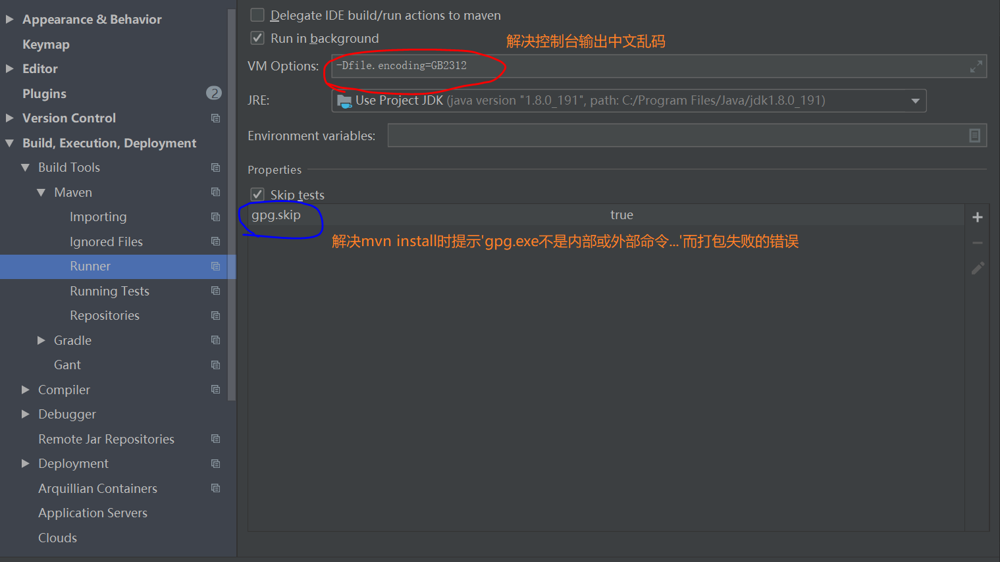

提供一些常用的工具类，基础服务：
aes加密
base64转码
日期处理工具类
文件处理工具类
HTTP服务
Email服务
Redis

部署命令：
> mvn clean deploy -Dmaven.test.skip=true

发布注意：
maven配置setting.xml：
servers模块中添加

    <server>
        <id>oss</id>
        <username>username</username>
        <password>password</password>
    </server>

其中username和password为jira的登录账号和密码；

统一对外颁发的RSA公钥：
MIGfMA0GCSqGSIb3DQEBAQUAA4GNADCBiQKBgQCQ3Vxu16+T6XXUVv9NJsALKTQkoywGR7bru4M17QCWsn/TBb7uEQNgChgafNwWNz5nYV0ierg4p9EAx6UvJYLwvP4tUg/7STOWDbTWmer2hl6AzkDKiaqbxAOr7PNc3lGr/Vd0Q/FgJ5FoJvyjdTgel4f15Z64c+ly4cXn9Uv2iQIDAQAB

如果idea mvn install时控制台中文乱码或提示 'gpg.exe不是内部或外部命令...' 导致打包失败时按如下进行配置：
> -Dfile.encoding=GB2312  
> gpg.skip=true
  

使用右侧Maven菜单deploy成功：
* mvn install时提示不是“gpg.exe”不是内部或外部命令时将安装的gpg.exe添加到环境变量，保证在命令行输入 "gpg.exe" 能正常响应，关闭idea，使用管理员打开继续install即可。
* gpg4win客户端无法将密钥发布到服务器时可手动发布。通过客户端将公钥导出（选中密钥行右键选择导出）并以文本方式打开，复制内容，进入网址 http://keyserver.ubuntu.com:11371/# 点击 SubmitKey 粘贴后提交即可。
